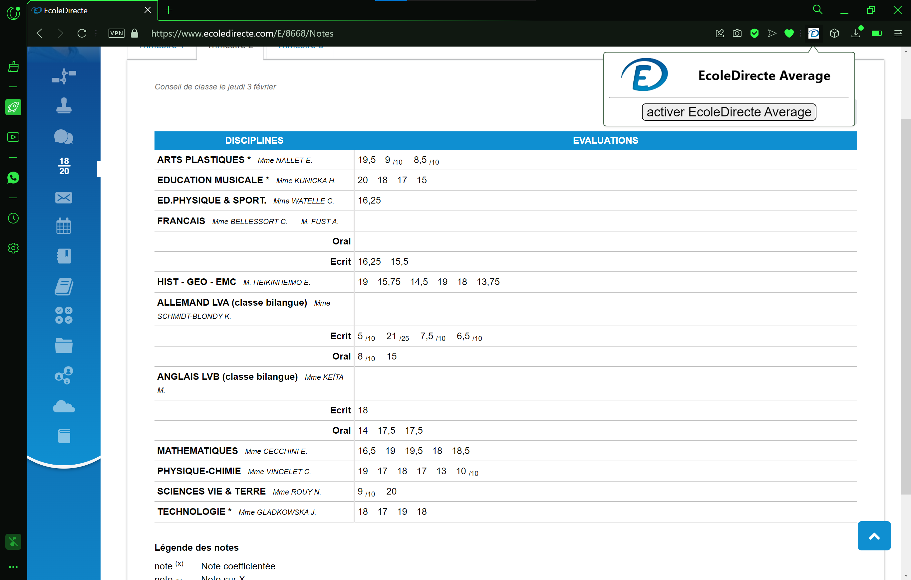
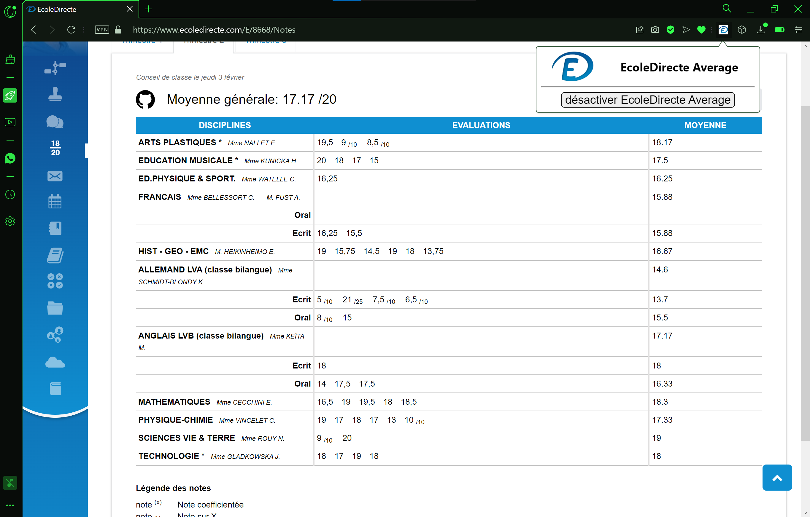

# EcoleDirecte-Average

Chrome extension to get your ED average

<h2>Functionality</h2>

<h2>How to install the extension</h2>

 - Save the entire folder called <code>ED-average</code>.

 - Open <code>chrome://extensions</code>.

 - active the developper mode (top right).

 - click to <code>load unpacked</code>.

 - select the <code>ED-average</code> folder.

 - It's finish, login to ecole directe to test the extension.

<h2>How it work</h2>

 - the <code>manifest.json</code> is the setting file to coordonate all file.

 - the <code>popup.js</code>, <code>popup.html</code> and <code>style.css</code> are the files that allow the layout of the pop-up.

 - the <code>content.js</code> is the file that calculates your average, displays or hides it.

