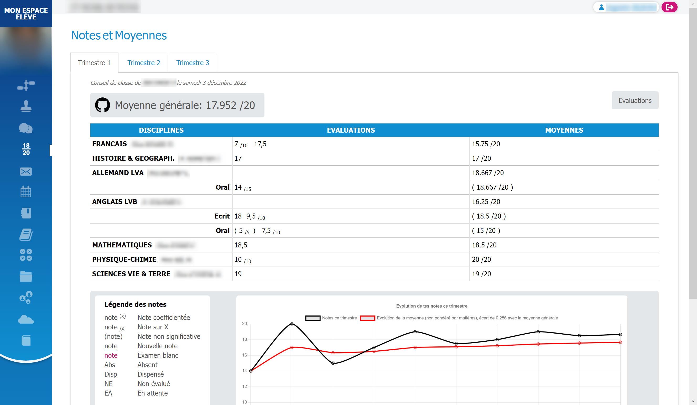

# EcoleDirecte-Average

Chrome extension to get your ED average

<h2>Functionality</h2>

<h2>How to install the extension</h2>

 - Save the folder <a href="https://github.com/augustin7698/EcoleDirecte-Average/raw/main/ED-Average.zip">ED-average</a>.

 - Unzip it.

 - Open <code>chrome://extensions</code>.

 - active the developper mode (top right).

 - click to <code>load unpacked</code>.

 - select the <code>ED-average</code> folder.

 - open <a href="https://www.ecoledirecte.com" target="_blank">EcoleDirecte</a>.

<h2>How it work</h2>

 - the <code>manifest.json</code> is the setting file to coordonate all file.

 - the <code>style.css</code> is the file that allow the layout of the inserted element.

 - the <code>content.js</code> is the file that calculates your average and displays it.

 - the <code>chart.js</code> is the file that generate the chart of your notes.

